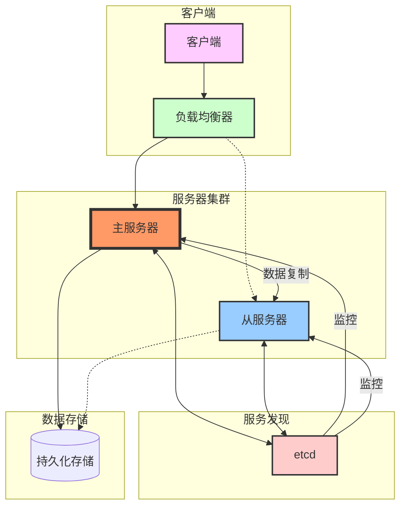

```mermaid
graph TD
    subgraph "客户端"
        C[客户端] --> LB[负载均衡器]
    end

    subgraph "服务发现"
        SD[etcd]
    end

    subgraph "服务器集群"
        LB --> S1[主服务器]
        LB -.-> S2[从服务器]
        S1 -- "数据复制" --> S2
    end

    S1 <--> SD
    S2 <--> SD

    subgraph "数据存储"
        DB[(持久化存储)]
    end

    S1 --> DB
    S2 -.-> DB

    %% 服务器选举和故障转移
    SD -- "监控" --> S1
    SD -- "监控" --> S2

    %% 说明
    classDef primary fill:#f96,stroke:#333,stroke-width:4px;
    classDef secondary fill:#9cf,stroke:#333,stroke-width:2px;
    classDef client fill:#fcf,stroke:#333,stroke-width:2px;
    classDef lb fill:#cfc,stroke:#333,stroke-width:2px;
    classDef sd fill:#fcc,stroke:#333,stroke-width:2px;
    class S1 primary;
    class S2 secondary;
    class C client;
    class LB lb;
    class SD sd;
```
