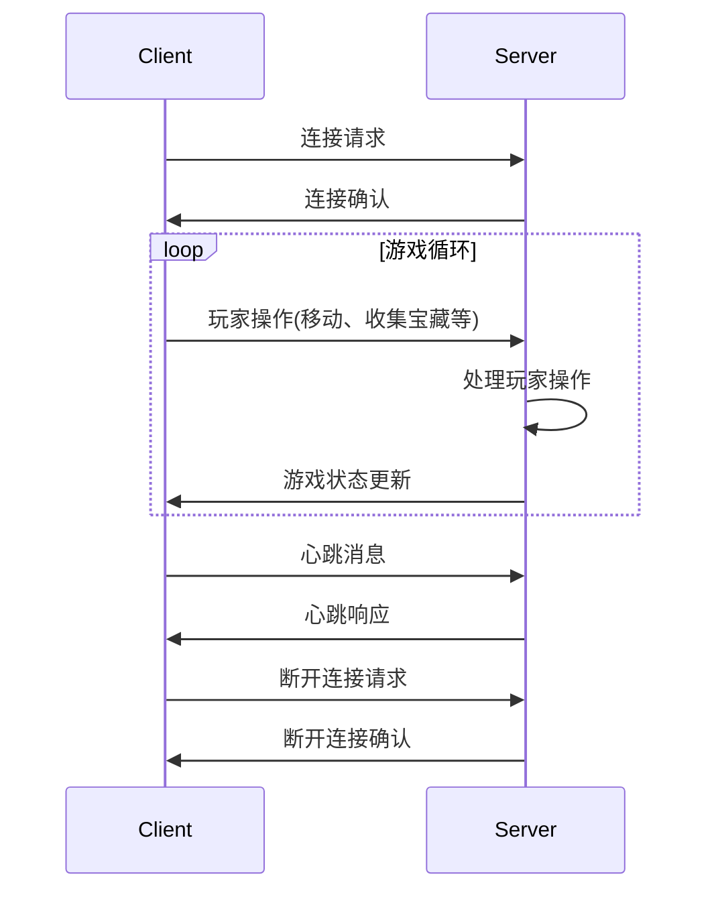
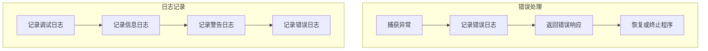
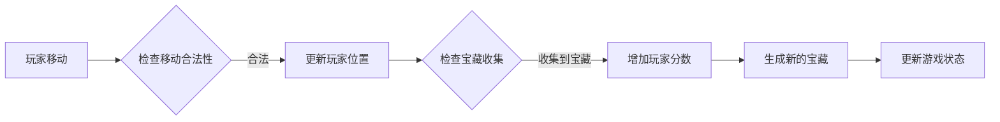
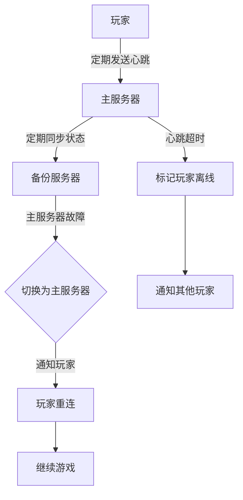
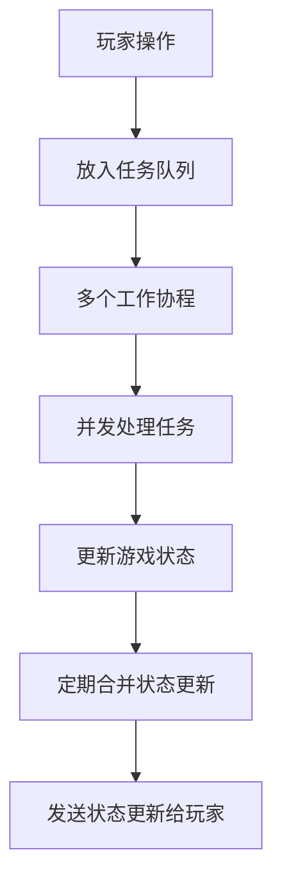
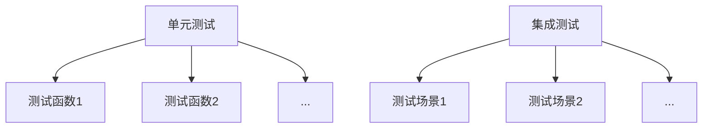
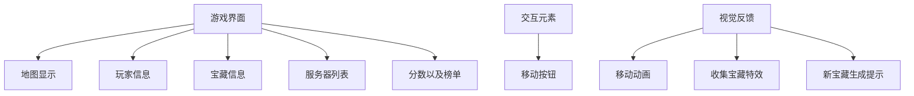

1. 实现详细的网络通信协议和消息处理

- 定义消息类型和格式,如连接请求、玩家操作、游戏状态更新、心跳消息等。
- 使用 TCP 协议进行可靠的消息传输。
- 服务器接收并解析客户端发送的消息,根据消息类型进行相应处理。
- 服务器将处理结果(如游戏状态更新)发送给客户端。
- 客户端定期发送心跳消息,服务器响应心跳,以检测连接的有效性。

2. 完善错误处理和日志记录

- 使用 Go 的 defer、recover 和 panic 机制进行错误处理。
- 在关键位置添加错误检查和处理逻辑,记录错误日志,并返回适当的错误响应。
- 使用 Go 的 log 包或第三方日志库(如 logrus、zap 等)进行日志记录。
- 根据日志级别(如调试、信息、警告、错误)记录不同类型的日志。
- 将日志输出到控制台或文件,方便问题定位和调试。

3. 实现完整的游戏逻辑

- 实现玩家移动逻辑,检查移动是否合法(如是否超出地图边界、是否与障碍物冲突等)。
- 如果移动合法,更新玩家位置。
- 检查玩家是否收集到宝藏,如果收集到宝藏,增加玩家分数,并生成新的宝藏。
- 更新游戏状态,将更新后的状态发送给所有玩家。

4. 实现容错机制

- 主服务器定期将游戏状态同步给备份服务器。
- 备份服务器监控主服务器的健康状态,当主服务器故障时,备份服务器切换为主服务器。
- 新的主服务器通知所有玩家重新连接。
- 玩家定期向服务器发送心跳消息,服务器通过心跳检测玩家在线状态。
- 当玩家心跳超时,服务器标记玩家为离线状态,并通知其他玩家。

5. 优化并发控制和性能

- 使用任务队列和工作协程模型,将玩家操作放入任务队列,多个工作协程并发处理任务。
- 使用锁或并发安全的数据结构(如 sync.Mutex、sync.RWMutex、sync.Map 等)保护共享的游戏状态。
- 采用定期合并状态更新的策略,减少状态更新的频率,提高网络传输效率。
- 对关键代码路径进行性能分析和优化,如减少锁的粒度、使用无阻塞算法等。

6. 添加更多的单元测试和集成测试

- 为关键的函数和方法编写单元测试,如玩家移动、宝藏收集、游戏状态更新等。
- 使用 Go 的 testing 包编写和运行单元测试。
- 编写集成测试,模拟真实的游戏场景,如多个玩家并发操作、主备切换、玩家掉线等。
- 完善用户界面,添加更多交互元素和视觉反馈

- 使用 GUI 库(Fyne)设计游戏界面。
- 游戏界面包括地图显示、玩家信息、宝藏信息、服务器列表、分数以及榜单元素。
- 添加交互元素,如移动按钮。
- 提供视觉反馈,如玩家移动动画、收集宝藏特效、新宝藏生成提示等。
- 优化界面布局和样式,提供良好的用户体验。
